# Stochastic SR for Gaussian textures


This code is associated with the preprint [Emile Pierret,Bruno Galerne (2024). Stochastic super-resolution for Gaussian microtextures. arXiv preprint arXiv:2405.15399.](https://arxiv.org/abs/2405.15399).


You can generate SR for some Gaussian textures examples of the folder ```Data``` by using the notebook ```Code.ipynb``` and downloading the two files ```operators.py``` and ```perdecomp.py```.


# Examples


<table>
  <tr><font size="5"> 
    <th> LR image </th>
    <th> HR image</th>
    <th> Reference image</th>
    <th> Gaussian SR sample </th>
    <th> Kriging component </th>
  </tr>
  </font> 
   <tr>
  <th>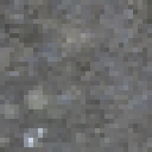</th>
 <th>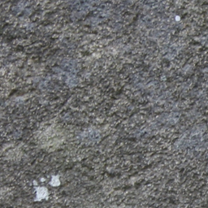</th>
     <th>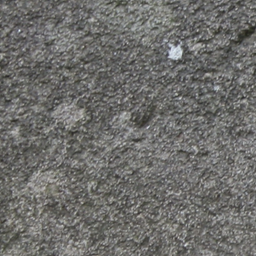</th>
      <th>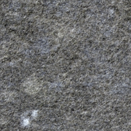</th>
      <th>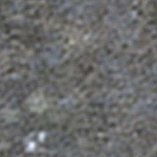</th>
     </tr> 
   <tr>
  <th></th>
 <th>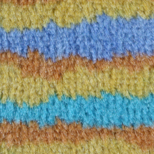</th>
     <th>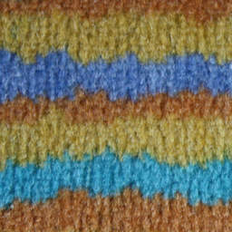</th>
      <th></th>
      <th>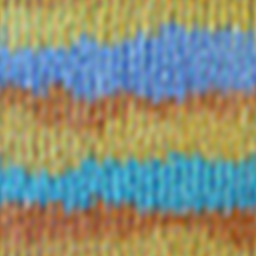</th>
     </tr> 
     <tr>
  <th>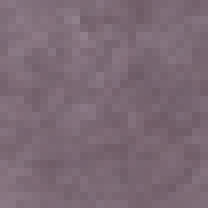</th>
 <th>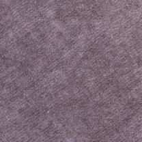</th>
     <th>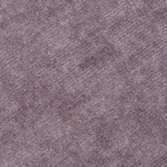</th>
      <th>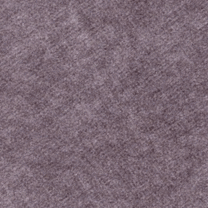</th>
      <th>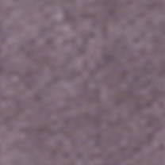</th>
     </tr> 
     <tr>
  <th>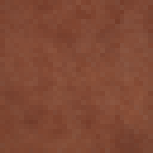</th>
 <th>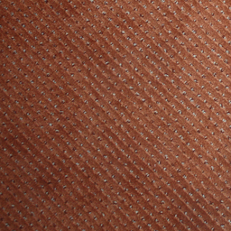</th>
     <th>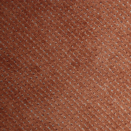</th>
      <th>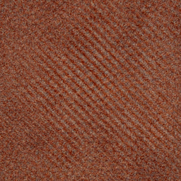</th>
      <th>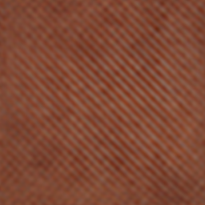</th>
     </tr> 
     <tr>
  <th>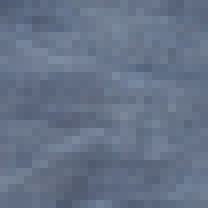</th>
 <th>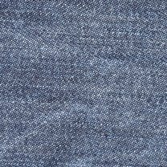</th>
     <th></th>
      <th>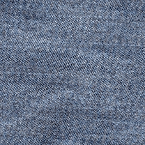</th>
      <th></th>
     </tr> 
     <tr>
  <th></th>
 <th>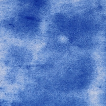</th>
     <th>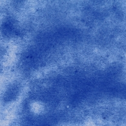</th>
      <th></th>
      <th>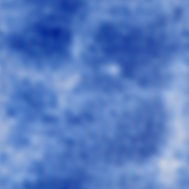</th>
     </tr> 
     <tr>
  <th>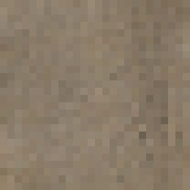</th>
 <th>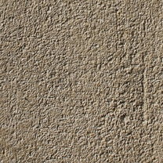</th>
     <th>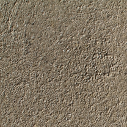</th>
      <th>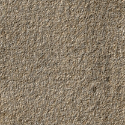</th>
      <th>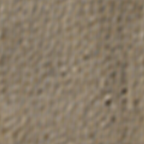</th>
     </tr> 
     <tr>
  <th>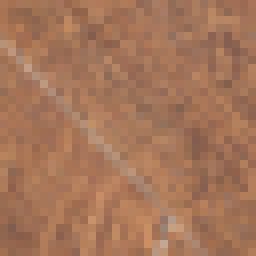</th>
 <th>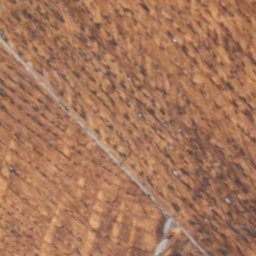</th>
     <th>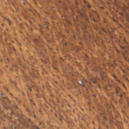</th>
      <th></th>
      <th>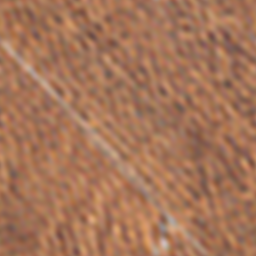</th>
     </tr> 
</table>
